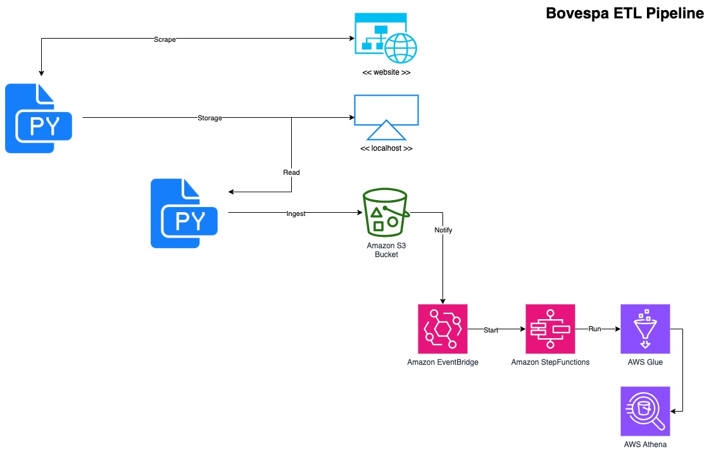

# Bovespa ETL Pipeline

This project demonstrates an ETL (Extract, Transform, Load) pipeline that extracts B3 trading data from the official website, ingests raw data into AWS S3 in Parquet format (with daily partitions), and triggers further data processing through AWS Lambda and AWS Glue. 

The processed data is then cataloged and made available in AWS Athena for querying.

# Project Overview

The main components of the pipeline include:
- Data Extraction: Extracts trading data from the B3 website.
- Data Ingestion: Loads raw data into an S3 bucket using a daily partition scheme.
- Trigger Mechanism: Configures S3 to trigger an AWS Lambda function.
- AWS Lambda: Initiates an AWS Glue ETL job.
- AWS Glue Job: Performs data transformations including numerical aggregation, renaming columns, and date calculations. The refined data is saved back to S3 in a partitioned Parquet format.
- Data Cataloging: The Glue job automatically catalogs data in the Glue Data Catalog.
- Data Analysis: Data is made available and queryable in AWS Athena.

# Data Source

The data used in this project is extracted from the official B3 website. You can access the data at [B3 Official Website](https://sistemaswebb3-listados.b3.com.br/indexPage/day/IBOV?language=pt-br).

# Project Architecture

Below is a high-level overview of the architecture:



1. Data Source: B3 trading data is extracted from the official website.
2. Data Ingestion: Raw data is stored in an S3 bucket in Parquet format with daily partitions.
3. Lambda Trigger: S3 events trigger a Lambda function to start the Glue ETL job.
4. ETL Processing: The Glue job processes and transforms the data, storing the refined output in a separate S3 directory (partitioned by date and trading symbol).
5. Data Catalog & Querying: Processed data is cataloged in the Glue Data Catalog and is accessible via Athena.

# Project Structure

```
bovespa-etl-pipeline/
├── docs/                   # Documentation and architecture diagrams
├── app/
│   ├── infra/
│   │   ├── s3/             # Terraform bucket creation
│   │   ├── eventbridge/    # Terraform event bridge creation
│   │   ├── stepfunctions/  # Terraform step functions creation
│   │   ├── glue/           # Terraform glue creation
│   │   ├── athena/         # Terraform athena creation
│   ├── services/
│   │   ├── scrape/         # Data extraction scripts
│   │   ├── ingest/         # Load data on S3
│   │   └── glue/           # AWS glue jobs scripts
│   └── deployment/         # Deployment scripts and configurations
└── README.md               # This file
```

# Features
- Data Extraction: Automated retrieval of B3 trading data.
- Batch Data Ingestion: Storage of raw data on S3 with daily partitions.
- Event-Driven Processing: Seamless integration between S3, Lambda, and Glue.
- Data Transformation: Implementation of transformations like numerical aggregation, column renaming, and date calculations.
- Cataloging & Querying: Automatic cataloging with AWS Glue and querying capabilities via AWS Athena.

# Setup

**1. Create a Virtual Environment**

Open your terminal in the repository's root, then run:

`python3 -m venv env`

**2. Activate the Virtual Environment**

`source env/bin/activate`

**3. Install the Requirements**

`pip install -r requirements.txt`


# Usage

**1. Extract Data**

Run the extraction process to retrieve data from the B3 website. Open your terminal in the repository's root, then run:

`python3 -m app.services.scrape.scrape`

**2. Ingestion and Trigger** 

Upload data to the S3 bucket to trigger the Lambda function. Open your terminal in the repository's root, then run:

`python3 -m app.services.ingest.ingest`

**3. ETL Execution**

Monitor the Glue job’s progress via AWS console.

**4. Querying Data**

Use Athena to run SQL queries against the refined data.

# Prerequisites
- An active AWS account.
- AWS CLI and SDKs installed and configured.
- Basic knowledge of AWS Glue, Athena, Lambda, and S3.
- [LocalStack](https://github.com/localstack/localstack) for local simulation of AWS services (S3, Lambda, etc.), if desired.
