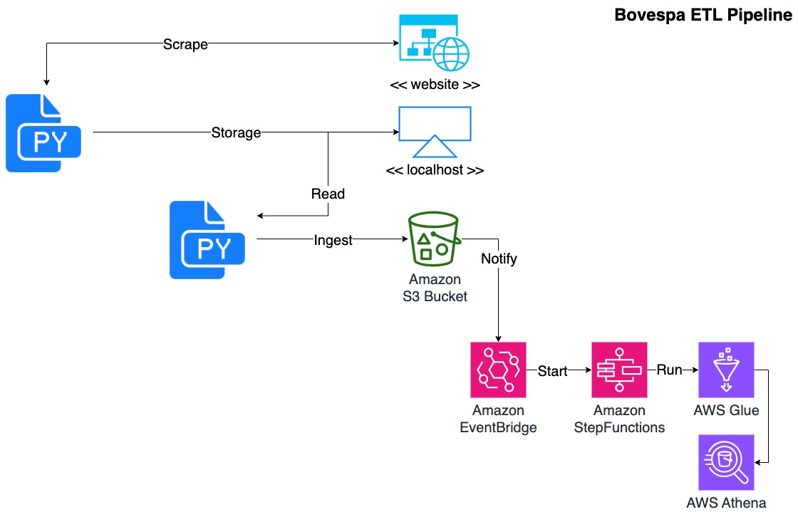

# Bovespa ETL Pipeline

This project demonstrates an ETL (Extract, Transform, Load) pipeline that extracts B3 trading data from the official website, ingests raw data into AWS S3 in Parquet format (with daily partitions), and triggers further data processing through AWS Event Bridge, AWS Step Functions, and AWS Glue. The processed data is then cataloged and made available in AWS Athena for querying.

# Project Overview

The main components of the pipeline include:
- Data Extraction: Extracts trading data from the B3 website.
- Data Ingestion: Loads raw data into an S3 bucket using a daily partition scheme.
- Trigger Mechanism: Configures S3 to trigger an AWS Event Bridge.
- AWS Step Functions: Initiates an AWS Glue ETL job.
- AWS Glue Job: Performs data transformations including numerical aggregation, renaming columns, and date calculations. The refined data is saved back to S3 in a partitioned Parquet format.
- Data Cataloging: The Glue job automatically catalogs data in the Glue Data Catalog.
- Data Analysis: Data is made available and queryable in AWS Athena.

# Data Source

The data used in this project is extracted from the official B3 website. You can access the data at [B3 Official Website](https://sistemaswebb3-listados.b3.com.br/indexPage/day/IBOV?language=pt-br).

# Project Architecture

Below is a high-level overview of the architecture:



- **Data Source:** B3 trading data is extracted from the official website and stored locally. 
- **Data Ingestion:** Raw data is stored in an S3 bucket in Parquet format with daily partitions.
- **Event Bridge Trigger:** S3 events trigger EventBridge to call the Step Functions state machine, which then starts the Glue ETL job.
- **ETL Processing:** The Glue job processes and transforms the data, storing the refined output in a separate S3 directory.
- **Data Catalog & Querying:** Processed data is cataloged in the Glue Data Catalog and is accessible via Athena.

# Project Structure

```
bovespa-etl-pipeline/
├── docs/                   # Documentation and architecture diagrams
├── app/
│   ├── infra/
│   │   ├── s3/             # Terraform bucket creation
│   │   ├── eventbridge/    # Terraform event bridge creation
│   │   ├── stepfunctions/  # Terraform step functions creation
│   │   └── glue/           # Terraform glue creation
│   ├── services/
│   │   ├── scrape/         # Data extraction scripts
│   │   ├── ingest/         # Load data on S3
│   │   ├── glue/           # AWS glue jobs scripts
│   │   └── athena/         # AWS Athena usage example
│   └── config.py/          
├── .gitignore
├── example.env
├── requirements.txt        
├── infra.tf                # Terraform main file
└── README.md               # This file
```

# Features
- Data Extraction: Automated retrieval of B3 trading data.
- Batch Data Ingestion: Storage of raw data on S3 with daily partitions.
- Event-Driven Processing: Seamless integration between S3, Event Bridge, Step Functions, and Glue.
- Data Transformation: Implementation of transformations like numerical aggregation, column renaming, and date calculations.
- Cataloging & Querying: Automatic cataloging with AWS Glue and querying capabilities via AWS Athena.

## Demonstration Video

Check out the video demonstration of the Bovespa ETL Pipeline in action:

[](https://youtu.be/WGozjAQLI94)

*Click the thumbnail or [here](https://youtu.be/WGozjAQLI94) to watch on YouTube.*

# Setup

**1. Create a Virtual Environment**

Open your terminal in the repository's root, then run:

`python3 -m venv env`

**2. Activate the Virtual Environment**

`source env/bin/activate`

**3. Install the Requirements**

`pip install -r requirements.txt`


# Usage

**1. Create AWS Resources**

Open your terminal in the repository's root, then run:

`export $(grep -v '^#' .env | xargs)`

`terraform init`

`terraform plan`

`terraform apply`

**2. Extract Data**

Run the extraction process to retrieve data from the B3 website. Open your terminal in the repository's root, then run:

`python3 -m app.services.scrape.scrape`

**3. Ingestion and Trigger** 

Upload data to the S3 bucket to trigger the Lambda function. Open your terminal in the repository's root, then run:

`python3 -m app.services.ingest.ingest`

**4. ETL Execution**

Monitor the Glue job’s progress via AWS console.

**5. Querying Data**

Use Athena to run SQL queries against the refined data. Open your terminal in the repository's root, then run:

`python3 -m app.services.athena.athena`

The script will generate visualization charts based on your Athena query results:


***This chart shows the average participation percentage of top stocks in the B3, highlighting which companies have the greatest weight in the Brazilian stock market composition.***

**6. Delete AWS Resources**

`terraform destroy`

# Prerequisites
- An active AWS account.
- AWS CLI and SDKs installed and configured.
- Terraform installed and configured.
- Make sure you configure your `.env` file as shown in `example.env`
- Basic knowledge of AWS Glue, Athena, Event Bridge, Step Functions, and S3.
- [LocalStack](https://github.com/localstack/localstack) for local simulation of AWS services (S3, Lambda, etc.), if desired.
